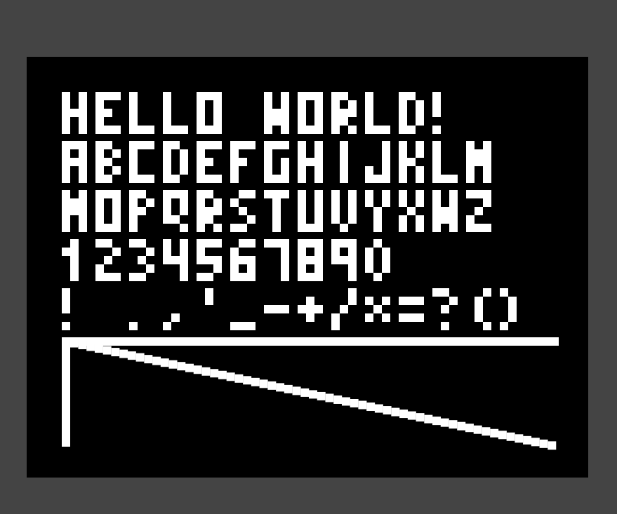
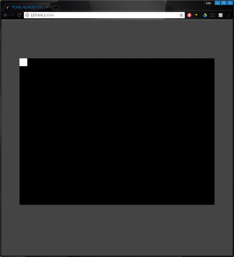
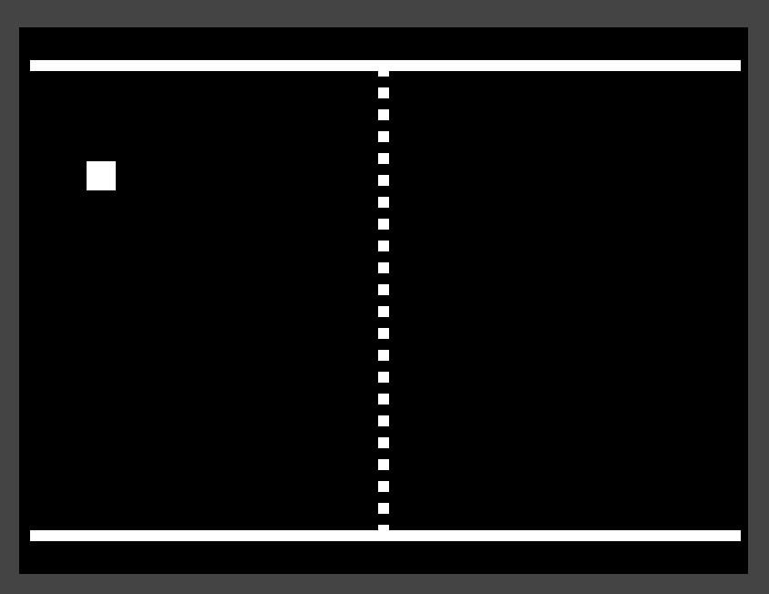
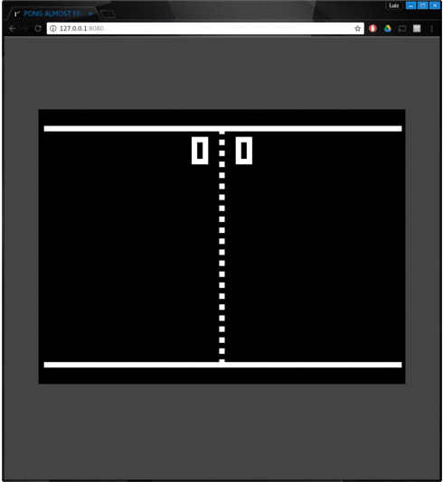
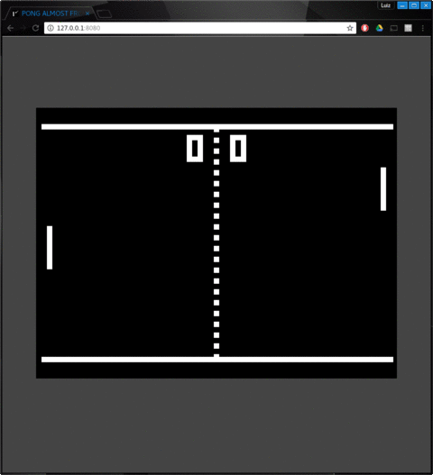
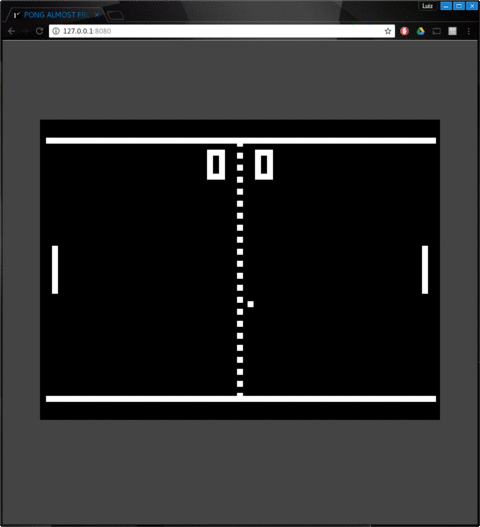

# PONG ALMOST FROM SCRATCH
This is an attempt of making the game pong using modern programming languages. The idea is to time the development and track the progress in this document.

## Tech
The game is based in html5/canvas, CSS and ES6 javascript.

## Goals
* ~~Add `LICENSE.md` and `README.md`~~
* ~~Create `html/canvas` base~~
* ~~Create the gameloop~~
* ~~Crate rendering functions~~
* ~~Design board~~
* ~~Create scoring system~~
* ~~Create paddle `class`~~
* ~~Create ball `class`~~
* ~~Implement collision mechanics~~
* ~~Host somewhere~~
* Create start screen
* Create enemy AI
* Add sounds
* Improve webpage

All that while reporting

## Progress reports
### Create `html/canvas` base

The `html` file was created based on a simple template.
```html
  <html>
    <head>
      <title>PONG ALMOST FROM SCRATCH</title>
      <meta name="description" content="This is an attempt of making the game pong using modern programming languages">
      <link id="favicon" rel="icon" href="assets/favicon.ico" type="image/x-icon">
      <meta charset="utf-8">
      <link rel="stylesheet" href="style.css">
    </head>
    <body>
      <div id="game-frame">
      </div>
      <script src="script.js"></script>
    </body>
  </html>
```

The `favicon.ico` was created using GIMP:


The canvas is created in the `javascript`.

I'll be using an ancient post from [Arthur Schreiber
](http://nokarma.org/2011/02/02/javascript-game-development-the-game-loop/index.html) as our base for the gameloop and keyboard input.
```javascript
"use strict"
let Game = {
  fps: 60,
  width: 800,
  height: 600
};
Game.canvas = document.createElement("canvas"); // Create canvas
Game.canvas.setAttribute("id", "game");
Game.canvas.width = Game.width;
Game.canvas.height = Game.height;

document.getElementById("game-frame").appendChild(Game.canvas); // Add canvas to game-frame

Game.context = Game.canvas.getContext("2d"); // Get canvas context
```
And a little bit of styling just to make it a little neat

```css
html {
  background-color: #444;
}
#game-frame {
  position: relative;
}

#game {
  background-color: #000;
  position: absolute;
  top: 50%;
  left: 50%;
  margin: 150px 0 0 -400px;
}
```
So, here is the first view of the game:
#### Hello world!


### Host somewhere

For now, I'll be hosting it in [github pages](https://pages.github.com/) since it's easy deploy. Check it out [here](https://armlessjohn404.github.io/pong-almost-from-scratch/)

### Crate rendering functions

The graphics in this game is not what one would call "realistic", so only one drawing function was created.
```javascript
function drawSquare(x, y, color="#FFF") {
  Game.context.fillStyle = color;
  Game.context.fillRect(x, y, gridSize, gridSize);
}
```
Another three functions uses this drawing function to speed up the development:
* `drawMatrix` which receives a boolean matrix to draw the dots.
* `writeText` which receives a string and uses `drawMatrix` and an alphabeth to draw the text.
* `drawLine` which receives two coordinates and draws a line between them.



The letters were created in a separate file. Each letter is a boolean 5x3 matrix.
```javascript
let alphabeth = {
  "A": [[1, 1, 1],[1, 0, 1],[1, 1, 1],[1, 0, 1],[1, 0, 1]],
  "B": [[1, 1, 0],[1, 0, 1],[1, 1, 0],[1, 0, 1],[1, 1, 0]],
  "C": [[0, 1, 1],[1, 0, 0],[1, 0, 0],[1, 0, 0],[0, 1, 1]],
  "D": [[1, 1, 0],[1, 0, 1],[1, 0, 1],[1, 0, 1],[1, 1, 0]],
  "E": [[1, 1, 1],[1, 0, 0],[1, 1, 0],[1, 0, 0],[1, 1, 1]],
  "F": [[1, 1, 1],[1, 0, 0],[1, 1, 0],[1, 0, 0],[1, 0, 0]],
  "G": [[1, 1, 1],[1, 0, 0],[1, 0, 1],[1, 0, 1],[1, 1, 1]],
  "H": [[1, 0, 1],[1, 0, 1],[1, 1, 1],[1, 0, 1],[1, 0, 1]],
  "I": [[0, 1, 0],[0, 1, 0],[0, 1, 0],[0, 1, 0],[0, 1, 0]],
  ...
```

I changed a little bit the numbers `2`, `3`, `5` and `6` from the original just because I can.
I've chosen 50 characters between letters, numbers and punctuation to use in the game.

### Create the gameloop
The gameloop is the engine that renders the graphics on screen in the correct time.
The gameloop was based on [Arthur Schreiber's
](http://nokarma.org/2011/02/02/javascript-game-development-the-game-loop/index.html) post with some tweaks. With that, I can get the player's input and update the screen.



### Board Design
The board for the game are just two horizontal lines and a dashed line in the center.



## Scoring system
For the scoring system, an object was created that draws the score in the screen when it's `draw` method is called and it's easy to update the values. It inherits some properties from a class called `BaseSprite`, that may be updated in the future. There's two important methods in these classes, the `update` method, that recalculates the new postion for the sprite and the `draw` method which draws the sprite in the screen.



## Paddle class
The `Paddle` class also inhertits from `BaseSprite`. Two instances of the paddles are created in the game, they bind to the keys `W` and `S` for player1 and `up arrow` and `down arrow` for player2.



## Ball class
The `Ball` class also inhertits from `BaseSprite`. They contain two extra properties: `speed` and `direction` to make it move in the screen.


## Collision mechanics
Since all the sprites are rectangles, the collision detection will be made with simple `if` statements, as described in [MDN](https://developer.mozilla.org/en-US/docs/Games/Techniques/2D_collision_detection).
The collision is checked in the update methods of. If the collision occurs in the left or right side, it means that it has hit the paddles, the calculation of the direction is a little bit different.


